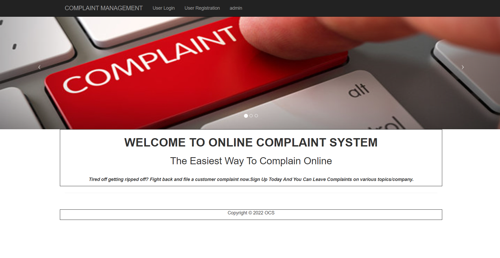
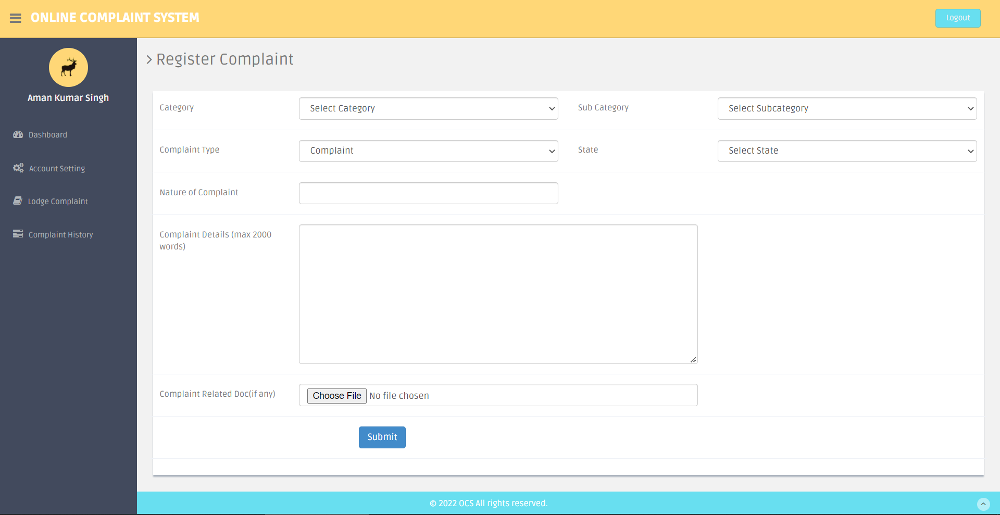

# Online Complaint System

The **Online Complaint System** is a web-based application developed using **PHP**, **HTML**, **CSS**, and **JavaScript**. This system is designed to improve the surroundings by enabling users to report incidents anonymously and securely.

## About the Project

This project is my **4th semester BCA project**, developed as part of the curriculum to showcase practical knowledge and application of web development technologies.

## Features

- Users can upload media files such as videos, photos, and audio related to incidents like robbery, murder, rape, consumer cheating, etc.
- Ensures user anonymity to maintain privacy and encourage reporting.
- Helps the Indian Government and citizens by providing evidence to punish accused individuals and reduce crime rates.
- Automatically forwards uploaded media to the Central Government, Central Media, State Government, and State Media via email.

## How to Run the System

### Prerequisites

1. **XAMPP** (or any local server environment).
2. A text editor like **Notepad++**, **Sublime Text**, or similar.
3. The **complaint-management-system** source code.

### Steps to Set Up

1. Download the zip file containing the project.
2. Extract the file and copy the `complaint-management-system` folder.
3. Paste the folder into the root directory of your XAMPP installation (e.g., `C:/xampp/htdocs`).
4. Open **PHPMyAdmin** by navigating to [http://localhost/phpmyadmin](http://localhost/phpmyadmin).
5. Create a new database named `cms`.
6. Import the `cms.sql` file located in the `SQL` folder of the extracted package.
7. Run the application by visiting [http://localhost/complaint-management-system](http://localhost/complaint-management-system).

### Admin Login Credentials

- **Username:** admin  
- **Password:** admin  

## Contribution

This system aims to assist the Indian Government and citizens in reducing crime and ensuring justice. Contributions to improve the system are welcome.

## License

This project is open-source and free to use for educational and non-commercial purposes.

## Screenshots

### Welcome Page

### Login Page

### User Dashboard

### Admin Dashboard

### Lodge Complaint Page

### Manage Complaints Page

